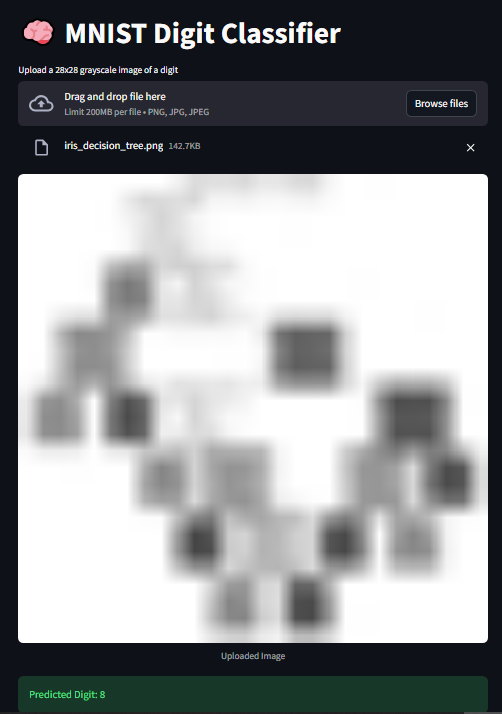

# 🧠 AI Tools Assignment — Full Project

**Author:** Njambi Hinga
**Description:** This project demonstrates an **end-to-end AI workflow** using multiple tools and frameworks. It covers **Theory, Practical Implementation, and Ethics & Optimization**, including optional deployment.

---

## 📖 Overview

This repository includes:

1. **Theory** — Conceptual understanding of AI frameworks.
2. **Practical Implementation** — Hands-on projects in Classical ML, Deep Learning (CNN), and NLP.
3. **Ethics & Optimization** — Model fairness, debugging, and optional deployment.

---

## 🗂️ Project Structure

```text
AI_Tools_Assignment/
├── Part1_Theory/
│   └── AI_Tools_Assignment_Part1_Theory.pdf
├── Part2_Practical/
│   ├── iris_classifier.ipynb
│   ├── mnist_cnn_tf.ipynb
│   ├── spacy_ner_sentiment.ipynb
│   ├── mnist_app.py          ← Optional Streamlit app (local)
│   ├── mnist_cnn_model.h5
│   └── Images/
│       ├── iris_pairplot.png
│       ├── iris_confusion_matrix.png
│       ├── iris_decision_tree.png
│       ├── iris_feature_importance.png
│       ├── mnist_samples.png
│       ├── mnist_training_curves.png
│       ├── mnist_confusion_matrix.png
│       ├── mnist_predictions.png
│       ├── mnist_app_screenshot.png   ← Screenshot of Streamlit app
│       ├── spacy_ner_example.html
│       └── spacy_sentiment_distribution.png
├── Part3_Ethics/
│   ├── AI_Tools_Assignment_Part3_Ethics.ipynb
│   └── ethics_reflection.pdf
└── README.md
```

---

## 🧩 Part 1 — Theory

Includes conceptual understanding of AI frameworks:

* **TensorFlow vs PyTorch** 🔄
* **Scikit-learn vs TensorFlow** ⚡
* **spaCy NLP advantages** 🗣️
* Use cases of **Jupyter Notebook** 📓

> Reference: `Part1_Theory/AI_Tools_Assignment_Part1_Theory.pdf`

---

## 🧩 Part 2 — Practical Implementation

### 1️⃣ Classical ML: Iris Dataset 🌸

* Notebook: `iris_classifier.ipynb`
* Model: Decision Tree
* Visualizations:

  * Pairplots
  * Confusion matrix
  * Decision tree diagram
  * Feature importance

---

### 2️⃣ Deep Learning: MNIST Dataset ✋

* Notebook: `mnist_cnn_tf.ipynb`

* Model: CNN for handwritten digit classification

* Saved plots in `Images/`:

  * Sample digits (`mnist_samples.png`)
  * Training curves (`mnist_training_curves.png`)
  * Confusion matrix (`mnist_confusion_matrix.png`)
  * Sample predictions (`mnist_predictions.png`)

* Optional Streamlit app:

  * `mnist_app.py` (runs locally)
  * Screenshot of app:



---

### 3️⃣ NLP: Amazon Reviews ✍️

* Notebook: `spacy_ner_sentiment.ipynb`
* Tasks:

  * Named Entity Recognition (NER) using **spaCy**
  * Sentiment Analysis using **TextBlob/VADER**
  * Visualization of entities & sentiment distribution (`spacy_ner_example.html`, `spacy_sentiment_distribution.png`)

---

## 🧩 Part 3 — Ethics & Optimization ⚖️

* Ethical considerations and bias analysis for MNIST & Amazon Reviews models.
* Debugging challenges for TensorFlow code.
* Reflections documented in:
  `Part3_Ethics/ethics_reflection.pdf`
* Bonus: Streamlit app screenshot included.

---

## 🛠️ Dependencies

* Python 3.x
* Packages:

```text
tensorflow
torch
torchvision
scikit-learn
spacy
pandas
numpy
matplotlib
seaborn
textblob
streamlit
pillow
```

*SpaCy English model:*

```bash
python -m spacy download en_core_web_sm
```

---

## 📌 How to Run Locally

1. Activate your virtual environment:

```bash
# Windows
.\venv\Scripts\activate
# macOS/Linux
source venv/bin/activate
```

2. Install dependencies:

```bash
pip install -r requirements.txt
```

3. Open notebooks for exploration:

```bash
jupyter notebook
```

4. (Optional) Run Streamlit app locally:

```bash
streamlit run Part2_Practical/mnist_app.py
```

---

## 📝 Notes

* All images are saved in `Part2_Practical/Images/`
* Streamlit app is optional; screenshot included for demonstration
* Notebooks are self-contained with explanations and visualizations

---

## 📚 References

* [TensorFlow Documentation](https://www.tensorflow.org/)
* [PyTorch Documentation](https://pytorch.org/)
* [Scikit-learn Documentation](https://scikit-learn.org/)
* [spaCy Documentation](https://spacy.io/)
* [MNIST Dataset](http://yann.lecun.com/exdb/mnist/)
